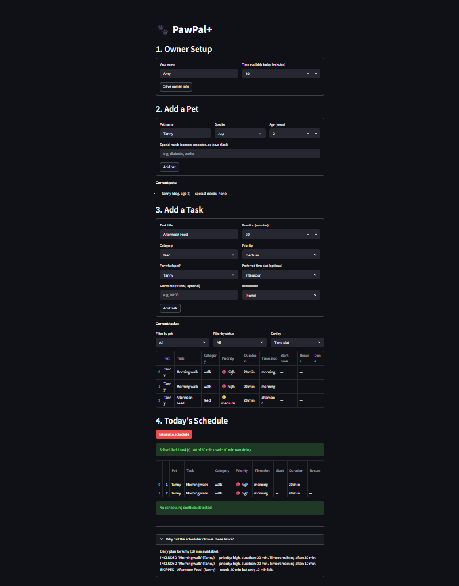
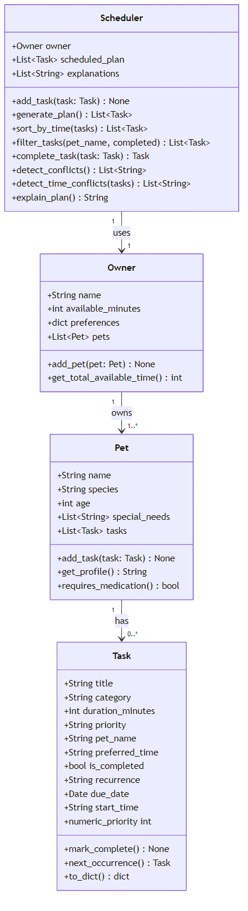
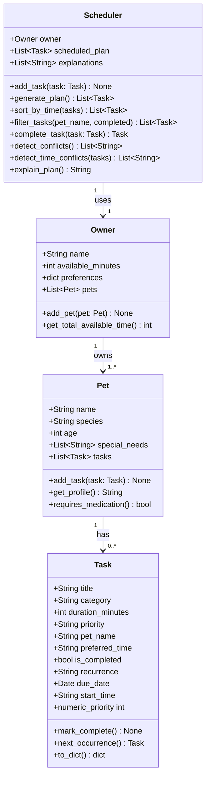

# PawPal+

A smart pet care scheduling app built with Python and Streamlit. PawPal+ helps pet owners build a daily care plan that fits their available time, respects task priorities, handles recurring routines, and flags scheduling conflicts before they become a problem.

---

## Demo



---

## Features

- **Priority-first greedy scheduling** — `generate_plan()` maps priority labels to integers (`low=1`, `medium=2`, `high=3`) and sorts candidates high → low, using duration as a tiebreaker (shorter tasks first). Tasks are added until the owner's time budget is exhausted; every inclusion and skip is logged for the reasoning view.
- **Chronological slot sorting** — `sort_by_time()` orders any task list morning → afternoon → evening → unspecified using a stable sort with a `TIME_SLOT_ORDER` lookup. The input list is never mutated. The daily plan is automatically re-sorted by slot after the greedy pass.
- **Daily and weekly recurrence** — tasks marked `recurrence="daily"` or `"weekly"` use `datetime.timedelta` to advance the due date by exactly 1 or 7 days. Calling `complete_task()` marks the task done and immediately registers the next occurrence under the same pet — no manual re-entry needed.
- **Slot budget conflict detection** — `detect_conflicts()` groups the scheduled plan by pet and time slot, then flags any combination whose total duration exceeds the 4-hour (240-minute) per-slot budget. Cross-pet totals are never combined, so one pet's heavy morning does not penalize another's.
- **Exact time-overlap detection** — `detect_time_conflicts()` checks every pair of tasks with an explicit `start_time` using the condition `A.start < B.end AND B.start < A.end`. This single expression catches all overlap shapes (partial, full containment, identical start) and labels each warning as same-pet or different-pets.
- **Combinable task filtering** — `filter_tasks(pet_name, completed)` returns a filtered subset of all tasks. Both parameters are optional and combinable: pass neither to return everything, or combine them to get (for example) only one pet's pending tasks.

---

## Getting Started

### Requirements

- Python 3.10+
- Streamlit

### Installation

```bash
python -m venv .venv
source .venv/bin/activate        # Windows: .venv\Scripts\activate
pip install -r requirements.txt
```

### Run the app

```bash
streamlit run app.py
```

---

## How to Use

### Step 1 — Owner setup
Enter your name and how many minutes you have available today. This is the time budget the scheduler works within.

### Step 2 — Add a pet
Enter your pet's name, species, age, and any special needs (e.g. `diabetic`, `senior`). Pets with medication-related needs are flagged automatically.

### Step 3 — Add tasks
For each task provide:

| Field | Required | Notes |
|---|---|---|
| Title | Yes | e.g. "Morning walk" |
| Category | Yes | walk / feed / medication / grooming / enrichment |
| Duration | Yes | Minutes |
| Priority | Yes | low / medium / high |
| Time slot | No | morning / afternoon / evening |
| Start time | No | HH:MM format — enables exact overlap detection |
| Recurrence | No | daily or weekly — auto-schedules next occurrence on completion |

Use the **Filter by pet**, **Filter by status**, and **Sort by** controls to browse your task list.

### Step 4 — Generate the schedule
Click **Generate schedule**. The app will:

1. Collect all incomplete tasks across all pets
2. Sort by priority (high → low), then duration (shorter first) as a tiebreaker
3. Greedily add tasks until the time budget is exhausted
4. Re-sort the final plan by time slot (morning → afternoon → evening)
5. Check for slot budget overflows and wall-clock overlaps, displaying warnings if found
6. Show a reasoning log explaining why each task was included or skipped

---

## Conflict Warnings

| Warning type | Trigger | Severity |
|---|---|---|
| Time overlap | Two tasks with `start_time` set whose windows overlap | Red — must resolve before running |
| Slot budget | A pet's total duration in one slot exceeds 4 hours | Yellow — plan still runs, but consider spreading tasks |

---

## Project Structure

```
pawpal_system.py   Core logic: Task, Pet, Owner, Scheduler classes
app.py             Streamlit UI
tests/
  test_pawpal.py   Pytest test suite (10 tests)
uml_final.png      Final class diagram
uml_final.mmd      Mermaid source for the diagram
reflection.md      Design decisions and project reflection
```

---

## Running Tests

```bash
python -m pytest tests/test_pawpal.py -v
```

| Area | Tests | What is verified |
|---|---|---|
| Sorting | 2 | Chronological slot order; input list not mutated |
| Recurrence | 3 | Daily follow-up due date; `None` for non-recurring; month-boundary dates |
| Conflict detection | 3 | Overlapping windows flagged; back-to-back not flagged; budgets are per-pet |
| Core behavior | 2 | `mark_complete()` flips status; `add_task()` grows the task list |

**Confidence: 4 / 5** — core scheduling logic is fully tested; `generate_plan` budget edge cases, cross-pet time-overlap warnings, and the UI layer are not yet covered.

---

## Class Diagram




