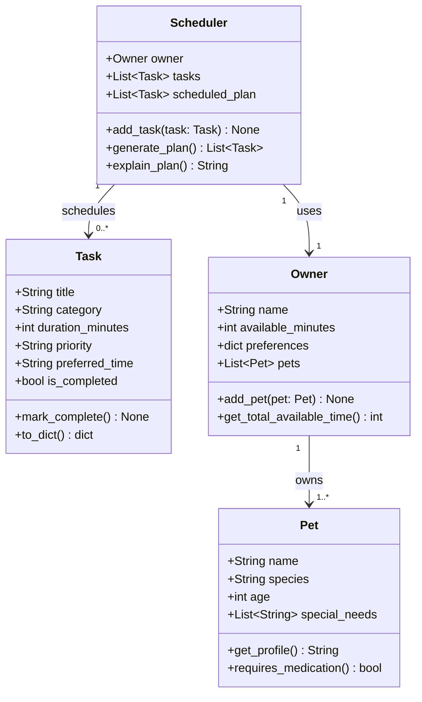

# PawPal+ Project Reflection

## 1. System Design

**a. Core user actions**

The three core actions a user should be able to perform in PawPal+ are:

1. **Add a pet** — The user enters basic information about their pet (name, species, age, any special needs). This establishes the subject of all care tasks and allows the app to personalize recommendations. Without a pet profile, nothing else in the system is meaningful.

2. **Add or edit a care task** — The user creates tasks such as walks, feedings, medication reminders, grooming sessions, or enrichment activities. Each task has at minimum a duration and a priority level so the scheduler can make informed decisions about what to include and in what order.

3. **Generate and view today's daily plan** — The user requests a scheduled plan for the day based on available time, task priorities, and any other constraints. The app produces an ordered list of tasks and explains why it chose that arrangement, helping the owner stay consistent with their pet's care routine.

**b. Main objects (classes), their attributes, and methods**

The system requires four main objects:

**`Pet`** — represents the animal being cared for.
- Attributes: `name`, `species`, `age`, `special_needs` (list of flags such as "diabetic" or "senior")
- Methods: `get_profile()` returns a summary string for display; `requires_medication()` returns True if a medication flag is present in special_needs

**`Task`** — a single care activity with scheduling metadata.
- Attributes: `title`, `category` (walk / feed / medication / grooming / enrichment), `duration_minutes`, `priority` (low / medium / high), `preferred_time` (optional window, e.g. "morning"), `is_completed`
- Methods: `mark_complete()` sets is_completed to True; `to_dict()` serializes the task for display or storage

**`Owner`** — the person managing care, holding preferences and time budget.
- Attributes: `name`, `available_minutes` (total time free today), `preferences` (soft constraints, e.g. prefers walks before noon), `pets` (list of Pet objects)
- Methods: `add_pet(pet)` appends a Pet to the owner's list; `get_total_available_time()` returns available_minutes

**`Scheduler`** — the core logic object that builds the daily plan.
- Attributes: `owner` (Owner instance), `tasks` (list of Task objects to consider), `scheduled_plan` (ordered list of tasks after scheduling)
- Methods: `add_task(task)` adds a task to the candidate list; `generate_plan()` sorts and filters tasks by priority and duration to fit within available time, then returns an ordered plan; `explain_plan()` returns a human-readable explanation of why each task was included or excluded

**c. UML Class Diagram**

**d. Initial design**

The initial design uses four classes: `Pet`, `Task`, `Owner`, and `Scheduler`.

`Pet` is a pure data container. Its responsibility is to represent the animal being cared for and expose whether it has any needs (like medication) that should influence scheduling. It holds no scheduling logic itself.

`Task` represents a single unit of care work. Its responsibility is to carry all the metadata the scheduler needs to make decisions — how long the task takes, how important it is, and when it ideally happens. It also tracks its own completion state via `mark_complete()`, keeping that concern local to the task rather than spread across the system.

`Owner` acts as the entry point and context provider. Its responsibility is to hold the human side of the equation: how much time is available today and any soft preferences (e.g. preferring walks in the morning). It also owns the list of pets, making it the natural root object for the whole session.

`Scheduler` is the only class with real logic. Its responsibility is to take the owner's constraints and a list of candidate tasks and produce an ordered, explainable daily plan. It is kept separate from `Owner` deliberately — the owner describes the situation, while the scheduler decides what to do about it. This separation makes the scheduling logic easier to test and swap out independently.

**b. Design changes**

Yes, the design changed in four ways after reviewing the initial skeleton:

1. **Added `pet_name` to `Task`.** The original `Task` had no reference to which pet it belonged to. Without this, a multi-pet household would produce a flat task list with no way to distinguish "walk Mochi" from "walk Biscuit". Adding `pet_name: str` as a field gives the scheduler (and the UI) the context it needs to group or label tasks correctly.

2. **Added `PRIORITY_ORDER` constant and `numeric_priority` property to `Task`.** The original design stored priority as a plain string (`"low"`, `"medium"`, `"high"`). Sorting by that string alphabetically produces the order `high → low → medium`, which is wrong. A module-level dict maps each label to an integer (1/2/3), and a `numeric_priority` property on `Task` exposes this so `generate_plan()` can sort correctly without duplicating the mapping logic.

3. **Added `self.explanations` to `Scheduler`.** The original design had `generate_plan()` return a task list and `explain_plan()` return a string, but provided no way for the two methods to share reasoning. The scheduling decisions (why a task was included or skipped) are made inside `generate_plan()`, so that method now populates `self.explanations` as a side effect. `explain_plan()` simply reads from it, keeping the logic in one place.

4. **Documented that `generate_plan()` must use a local `remaining_minutes` counter.** The time budget lives on `owner.available_minutes`. If `generate_plan()` decremented that value directly, it would permanently reduce the owner's stated availability — a side effect that would break any second call. A local copy used only inside the method avoids mutating the owner's state.

---

## 2. Scheduling Logic and Tradeoffs

**a. Constraints and priorities**

The scheduler considers three constraints:

1. **Time budget** — the owner's `available_minutes` acts as a hard cap. A task is only included if its `duration_minutes` fits within what remains. This is the strictest constraint because no amount of priority can make a 60-minute task fit in 10 remaining minutes.

2. **Priority** — tasks are ranked using a `PRIORITY_ORDER` integer map (`low=1`, `medium=2`, `high=3`) so the greedy pass always fills the budget with the most important tasks first. Priority was chosen as the primary sort key because the owner explicitly assigns it — it directly encodes their intent.

3. **Duration as a tiebreaker** — when two tasks share the same priority, shorter tasks are scheduled first. This maximizes the number of tasks that fit within the budget, which is a better outcome than scheduling one long high-priority task and running out of time before shorter ones of equal priority.

Preferred time slot and start time are soft constraints used for display and conflict detection, not for inclusion/exclusion decisions. This was a deliberate choice: a task's urgency shouldn't change just because it has no preferred time assigned.

**b. Tradeoffs**

**Tradeoff: `detect_time_conflicts()` only checks tasks that have an explicit `start_time` — tasks without one are silently skipped.**

The scheduler supports two ways to express timing: a loose `preferred_time` slot ("morning", "afternoon", "evening") and a precise `start_time` in HH:MM format. Conflict detection runs only on tasks with `start_time` set, because slot-only tasks have no concrete window to compare against. A task marked "morning" could mean 7 AM or 11 AM — there is no single minute-value to subtract from another.

This means two tasks that both say "morning" will never trigger a conflict warning, even if a pet owner naively adds a 3-hour walk and a 30-minute grooming session to the same slot. The existing `detect_conflicts()` method partially compensates by flagging when the *total duration* in a slot exceeds the slot's 4-hour budget, but that is a softer check — it warns about overload, not about literal simultaneous scheduling.

The tradeoff is reasonable for this stage of the app because:
1. Most casual pet owners think in approximate slots ("give meds in the morning"), not wall-clock times, so requiring `start_time` everywhere would be a friction increase for little gain.
2. The slot-budget check (`detect_conflicts`) already catches the most common over-scheduling mistake.
3. If the owner *does* care about precise scheduling (e.g. medication must be at 8:00 AM, vet visit at 8:30 AM), they can opt into `start_time` and get the full overlap check.

A future improvement would be to assign default minute-ranges to each slot (morning = 06:00–12:00, afternoon = 12:00–18:00, evening = 18:00–22:00) and flag slot-only tasks whose combined duration exceeds their slot window, closing the gap between the two detection methods.

---

## 3. AI Collaboration

**a. How you used AI**

I used Claude Code (via the VS Code extension) across every phase of the project, but the way I used it changed depending on the task:

- **Design phase** — I used it to audit my initial UML against the final code. The most effective prompt style was asking Claude to compare a specific artifact (the Mermaid diagram in `reflection.md`) against a specific file (`pawpal_system.py`) and list exact discrepancies. This produced a precise diff table rather than vague suggestions.

- **Testing phase** — I asked Claude to identify the most important edge cases given the specific algorithms in the codebase (greedy scheduling, `timedelta` recurrence, overlap arithmetic). Prompting with the actual method names and the conditions they use (e.g. `a_start < b_end AND b_start < a_end`) led to tests that targeted real failure modes rather than generic "it should work" checks.

- **UI phase** — I asked Claude to identify which Scheduler methods were not being used in `app.py` and to replace the manual workarounds with the proper method calls. Having Claude read both files before suggesting changes meant every edit was grounded in the actual code.

- **Documentation phase** — I used Claude to rewrite the README from assignment-voice ("your job is to…") to product-voice ("PawPal+ helps pet owners…"), and to update the Features section to name the actual algorithms rather than describe them vaguely.

The most effective prompt pattern throughout was: *"read this file, compare it to that file, tell me what is missing or wrong."* Open-ended prompts like "improve the app" produced suggestions that were too broad. Specific, comparative prompts produced actionable, scoped output.

**b. Judgment and verification**

One clear example: when Claude generated the initial `detect_time_conflicts()` description for the README Features section, it wrote "flags overlapping tasks" — which is accurate but says nothing about *how*. I pushed back and asked it to name the exact overlap condition (`A.start < B.end AND B.start < A.end`) and explain that it catches all four overlap shapes. The original phrasing would have been fine for a casual README, but since the Features section is meant to describe the algorithms I implemented, the precise condition is the important part.

More broadly, I verified every AI suggestion against the source code before accepting it. When Claude said "the Scheduler stores tasks directly," I checked `pawpal_system.py` and found that tasks live on `Pet`, not `Scheduler` — so that description was wrong and I corrected it. The rule I developed: treat AI output as a first draft written by someone who has read the code once, not as ground truth.

---

## 4. Testing and Verification

**a. What you tested**

The test suite covers four areas across 10 tests:

1. **Sorting correctness** — `sort_by_time()` returns tasks in morning → afternoon → evening → unspecified order, and the original list is not mutated. These matter because a silent sort bug (like alphabetical fallback) would produce a wrong order without raising an error.

2. **Recurrence logic** — completing a daily task creates a follow-up with the correct due date, non-recurring tasks return `None`, and a task due on Jan 31 advances to Feb 1 (not a crash or Jan 32). The month-boundary test specifically targets the `timedelta` calculation — if someone had used `due_date.day + 1` manually, this test would catch it.

3. **Conflict detection** — overlapping wall-clock windows are flagged, back-to-back tasks are not, and slot-budget overflows are checked per-pet (not summed across pets). The back-to-back test guards the boundary condition in `a_start < b_end AND b_start < a_end`, which is easy to get wrong.

4. **Core behavior** — `mark_complete()` flips `is_completed`, and `add_task()` grows the pet's task list. These are the foundation everything else depends on.

**b. Confidence**

**4 / 5.** The core scheduling algorithms — priority sorting, `timedelta` recurrence, overlap detection — are exercised with targeted tests including edge cases, and all 10 pass. Confidence is not 5/5 because the `generate_plan()` budget-exhaustion boundary (`<=` vs `<`) is not directly tested, cross-pet time-overlap warnings have no test, and the Streamlit UI has no automated coverage. If I had more time, I would add: a test where a task fits exactly at the budget boundary (30 min left, 30-min task — must be included), a test where a high-priority task is picked over two lower-priority tasks that together would fill the budget more efficiently, and a test confirming `complete_task()` on a recurring task adds the follow-up to the right pet when there are multiple pets.

---

## 5. Reflection

**a. What went well**

The part I'm most satisfied with is the conflict detection architecture. Having two separate methods — `detect_conflicts()` for slot budget overflows and `detect_time_conflicts()` for exact wall-clock overlaps — and surfacing them as different severity levels in the UI (red for overlap, yellow for budget) reflects a real design decision: not all warnings are equal. An overlap means two things literally cannot happen simultaneously; a budget overflow means a slot is heavy but still runnable. Getting that distinction right in both the backend logic and the Streamlit display felt like the most complete piece of the system.

**b. What you would improve**

The greedy scheduler is easy to understand but has a real weakness: it cannot "pack" the budget optimally. If the owner has 50 minutes left and there's one 55-minute medium task and two 25-minute low tasks, the scheduler skips the medium task and fits the two low-priority ones — which may not be what the owner wants. A future version would consider a simple knapsack approach for the final few tasks when the greedy pass leaves significant time unused. I would also add a `due_date` filter to `generate_plan()` so that tasks with a future due date aren't scheduled today even if they are technically pending.

**c. Key takeaway**

The most important thing I learned is that AI is most useful when you give it a specific, bounded question against specific artifacts — not when you ask it to "improve" or "build" something open-ended. The moments where Claude was least helpful were when I asked broad questions; the moments where it was most helpful were when I said "compare these two files and list what is missing." That forced me to stay in the role of lead architect: I had to know what I was looking for, decide which suggestions were right, and push back on the ones that were accurate-but-imprecise. The AI accelerated the work, but every decision about what the system should do and how the pieces should fit together had to come from me first.
