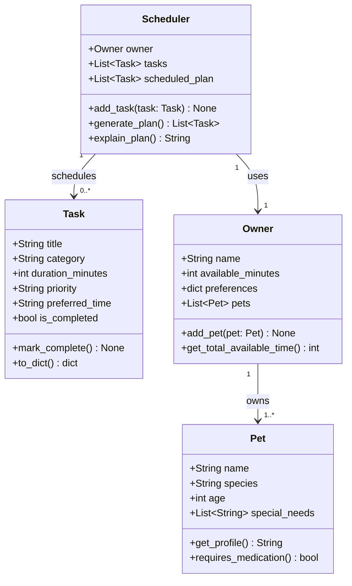

# PawPal+ Project Reflection

## 1. System Design

**a. Core user actions**

The three core actions a user should be able to perform in PawPal+ are:

1. **Add a pet** — The user enters basic information about their pet (name, species, age, any special needs). This establishes the subject of all care tasks and allows the app to personalize recommendations. Without a pet profile, nothing else in the system is meaningful.

2. **Add or edit a care task** — The user creates tasks such as walks, feedings, medication reminders, grooming sessions, or enrichment activities. Each task has at minimum a duration and a priority level so the scheduler can make informed decisions about what to include and in what order.

3. **Generate and view today's daily plan** — The user requests a scheduled plan for the day based on available time, task priorities, and any other constraints. The app produces an ordered list of tasks and explains why it chose that arrangement, helping the owner stay consistent with their pet's care routine.

**b. Main objects (classes), their attributes, and methods**

The system requires four main objects:

**`Pet`** — represents the animal being cared for.
- Attributes: `name`, `species`, `age`, `special_needs` (list of flags such as "diabetic" or "senior")
- Methods: `get_profile()` returns a summary string for display; `requires_medication()` returns True if a medication flag is present in special_needs

**`Task`** — a single care activity with scheduling metadata.
- Attributes: `title`, `category` (walk / feed / medication / grooming / enrichment), `duration_minutes`, `priority` (low / medium / high), `preferred_time` (optional window, e.g. "morning"), `is_completed`
- Methods: `mark_complete()` sets is_completed to True; `to_dict()` serializes the task for display or storage

**`Owner`** — the person managing care, holding preferences and time budget.
- Attributes: `name`, `available_minutes` (total time free today), `preferences` (soft constraints, e.g. prefers walks before noon), `pets` (list of Pet objects)
- Methods: `add_pet(pet)` appends a Pet to the owner's list; `get_total_available_time()` returns available_minutes

**`Scheduler`** — the core logic object that builds the daily plan.
- Attributes: `owner` (Owner instance), `tasks` (list of Task objects to consider), `scheduled_plan` (ordered list of tasks after scheduling)
- Methods: `add_task(task)` adds a task to the candidate list; `generate_plan()` sorts and filters tasks by priority and duration to fit within available time, then returns an ordered plan; `explain_plan()` returns a human-readable explanation of why each task was included or excluded

**c. UML Class Diagram**

**d. Initial design**

- Briefly describe your initial UML design.
- What classes did you include, and what responsibilities did you assign to each?

**b. Design changes**

- Did your design change during implementation?
- If yes, describe at least one change and why you made it.

---

## 2. Scheduling Logic and Tradeoffs

**a. Constraints and priorities**

- What constraints does your scheduler consider (for example: time, priority, preferences)?
- How did you decide which constraints mattered most?

**b. Tradeoffs**

- Describe one tradeoff your scheduler makes.
- Why is that tradeoff reasonable for this scenario?

---

## 3. AI Collaboration

**a. How you used AI**

- How did you use AI tools during this project (for example: design brainstorming, debugging, refactoring)?
- What kinds of prompts or questions were most helpful?

**b. Judgment and verification**

- Describe one moment where you did not accept an AI suggestion as-is.
- How did you evaluate or verify what the AI suggested?

---

## 4. Testing and Verification

**a. What you tested**

- What behaviors did you test?
- Why were these tests important?

**b. Confidence**

- How confident are you that your scheduler works correctly?
- What edge cases would you test next if you had more time?

---

## 5. Reflection

**a. What went well**

- What part of this project are you most satisfied with?

**b. What you would improve**

- If you had another iteration, what would you improve or redesign?

**c. Key takeaway**

- What is one important thing you learned about designing systems or working with AI on this project?
